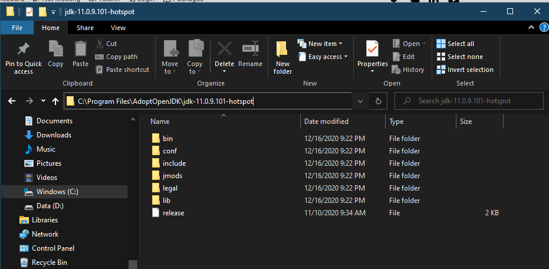
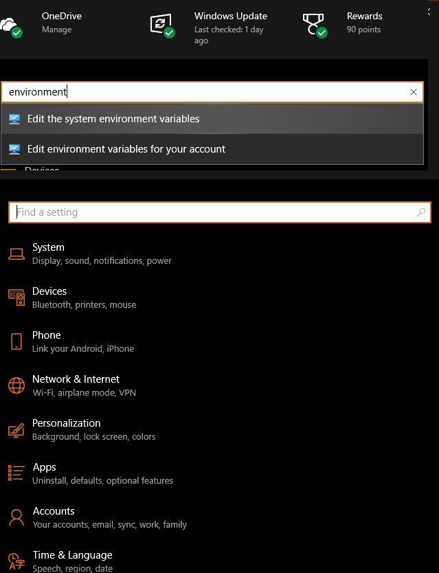
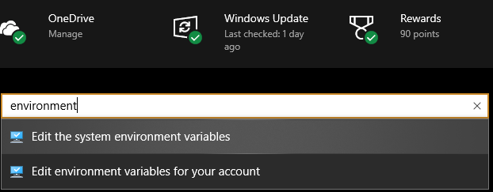
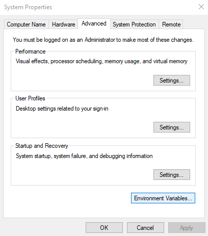
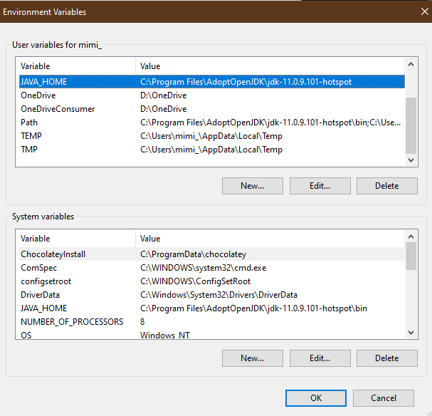
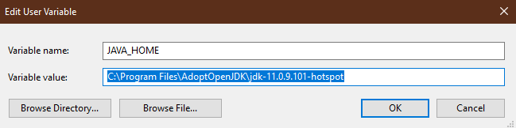
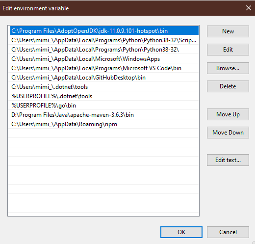
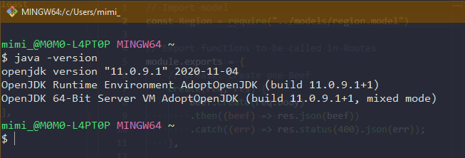
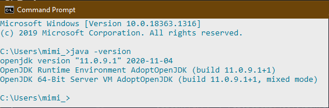

# Java Intro

## Expectations

- Act job ready
- Read ahead
- Participate in discussion
  - _"One who speaks is the who learns" - Unknown_
- Ask questions
  - REMEMBER THE 20 MIN RULE!!
- Tell instructor what to do based on your discovery
- Let Chris/Monica know if you will be absent - no reason necessary

### DISCLAIMER: We are not using IDE Spring. Even though the Learn Platform shows it, we will instead use VS Code to build our apps. We will show how to use VS Code extensions and commands to run Java.

## Weekend Preparation

- [ ] Install Java 11/15 (MacOS - v15 is the only one I can download)
- [ ] Install Maven
- [ ] Read ahead
- [ ] Test `java -version` && `mvn --version`

## Guides / Resources

[JDK11](https://www.oracle.com/java/technologies/javase-jdk11-downloads.html)

[VSCode - Java Spring Boot Intro](https://code.visualstudio.com/docs/java/java-spring-boot)

[Oracle - Java At A Glance](https://www.oracle.com/java/technologies/java-se-glance.html)

[Download Maven](https://maven.apache.org/download.cgi)

[MacOS Maven Install](https://www.journaldev.com/2348/install-maven-mac-os)

[VSCode - Java Tutorial](https://code.visualstudio.com/docs/java/java-tutorial)

[Medium.com - Create Spring Boot App Using VS Code](https://medium.com/programming-is-hard/creating-a-hello-world-spring-boot-app-using-vs-code-f59b1e2e95d)

## ENVIRONMENT VARIABLES FOR WINDOWS

### We are going to copy the location of our Java 11 path into our Environment Variables. There are various tutorials, but here is my simple solution.

1. Locate in **File Explorer** the folder where Java 11 is installed:

- 

2. Open **Windows** button and click the **Settings** button
3. Should Open Settings:

- 

4. Search for _environment_.. **Select Edit the system environment variables**

- 

5. Should open System Properties. Next click **Advanced** tab and then click **Environment Variables** button:

- 

6. Environment Variables are opened now...

- 

7. Notice there are 2 sections:
   a. 1 is User variable
   b. 2 is System variables
8. Changes can be made to both. We will add _JAVA_HOME_ and add to _Path_ variables
9. If JAVA_HOME is not there, you can click New to create it.

- 

10. Write the variable name as _JAVA_HOME_ and variable value is the location path we found in the beginning. Copy and Paste the address in here.
11. Press **OK**
12. Next Select **Path** and click **Edit** and we are going to add the same variable to a list of existing sources

- 

14. If you don't see the directly on the list, you can click New to add it in.
15. Same Copy and Paste
16. Click **OK**
17. Click **OK** to close _Environment Variables_
18. Next we need to reboot the system
19. 1 Last Step to double check in terminal.
20. Open GitBash or Command Prompt
21. Type: **java -version**
22. Double check your output:

- GitBash:
  - 
- Command Prompt:
  - 
